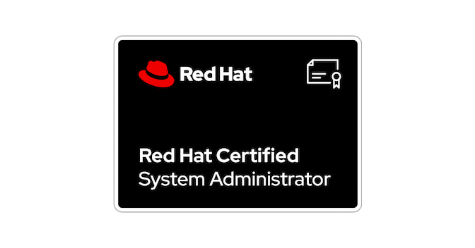

# **RHCSA (EX200) TRAINING**

The **Red Hat Certified System Administrator (RHCSA)** certification is an important credential for IT professionals who work in Linux environments. This certification validates the core skills required to manage and configure Red Hat Enterprise Linux (RHEL) systems. Achieving RHCSA demonstrates proficiency in essential system administration tasks, including installation, configuration, and maintenance of RHEL systems.

### Why is RHCSA important?

The RHCSA certification is highly valued by employers because it proves that you have the ability to work with Linux systems, automate tasks, secure systems, and manage network configurations. Whether you're pursuing a career in system administration, cloud computing, or DevOps, the skills covered in RHCSA are foundational.

## **[Understand and use essential tools](UnderstaningAndUsingEssentialsTools.md)**

- Access a shell prompt and issue commands with correct syntax
- Use input-output redirection (>, >>, |, 2>, etc.)
- Use `grep` and regular expressions to analyze text
- Access remote systems using SSH
- Log in and switch users in multiuser targets
- Archive, compress, unpack, and uncompress files using `tar`, `gzip`, and `bzip2`
- Create and edit text files
- Create, delete, copy, and move files and directories
- Create hard and soft links
- List, set, and change standard `ugo/rwx` permissions
- Locate, read, and use system documentation including `man`, `info`, and files in `/usr/share/doc`

## **[Create simple shell scripts](#create-simple-shell-scripts)**

- Conditionally execute code (use of: `if`, `test`, `[]`, etc.)
- Use Looping constructs (for, etc.) to process file, command line input
- Process script inputs (`$1`, `$2`, etc.)
- Process output of shell commands within a script

## **[Operate running systems](#operate-running-systems)**

- Boot, reboot, and shut down a system normally
- Boot systems into different targets manually
- Interrupt the boot process in order to gain access to a system
- Identify CPU/memory intensive processes and kill processes
- Adjust process scheduling
- Manage tuning profiles
- Locate and interpret system log files and journals
- Preserve system journals
- Start, stop, and check the status of network services
- Securely transfer files between systems

## **[Configure local storage](#configure-local-storage)**

- List, create, delete partitions on MBR and GPT disks
- Create and remove physical volumes
- Assign physical volumes to volume groups
- Create and delete logical volumes
- Configure systems to mount file systems at boot by UUID or label
- Add new partitions and logical volumes, and swap to a system non-destructively

## **[Create and configure file systems](#create-and-configure-file-systems)**

- Create, mount, unmount, and use `vfat`, `ext4`, and `xfs` file systems
- Mount and unmount network file systems using NFS
- Configure `autofs`
- Extend existing logical volumes
- Create and configure set-GID directories for collaboration
- Diagnose and correct file permission problems

## **[Deploy, configure, and maintain systems](#deploy-configure-and-maintain-systems)**

- Schedule tasks using `at` and `cron`
- Start and stop services and configure services to start automatically at boot
- Configure systems to boot into a specific target automatically
- Configure time service clients
- Install and update software packages from Red Hat Network, a remote repository, or from the local file system
- Modify the system bootloader

## **[Manage basic networking](#manage-basic-networking)**

- Configure IPv4 and IPv6 addresses
- Configure hostname resolution
- Configure network services to start automatically at boot
- Restrict network access using `firewall-cmd`/`firewalld`

## **[Manage users and groups](#manage-users-and-groups)**

- Create, delete, and modify local user accounts
- Change passwords and adjust password aging for local user accounts
- Create, delete, and modify local groups and group memberships
- Configure superuser access

## **[Manage security](#manage-security)**

- Configure firewall settings using `firewall-cmd`/`firewalld`
- Manage default file permissions
- Configure key-based authentication for SSH
- Set enforcing and permissive modes for SELinux
- List and identify SELinux file and process context
- Restore default file contexts
- Manage SELinux port labels
- Use boolean settings to modify system SELinux settings
- Diagnose and address routine SELinux policy violations

## **[Manage containers](#manage-containers)**

- Find and retrieve container images from a remote registry
- Inspect container images
- Perform container management using commands such as `podman` and `skopeo`
- Perform basic container management such as running, starting, stopping, and listing running containers
- Run a service inside a container
- Configure a container to start automatically as a systemd service
- Attach persistent storage to a container
